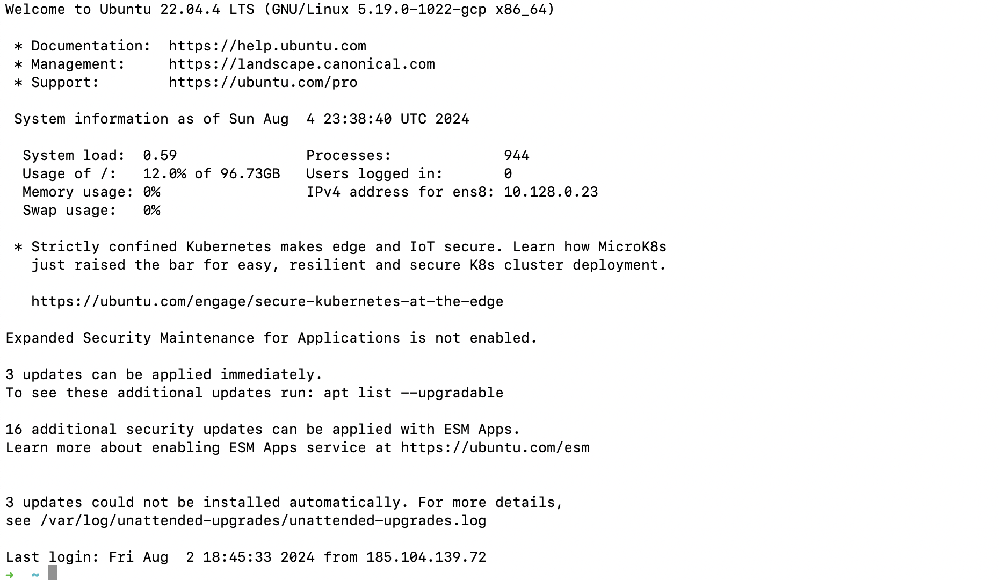
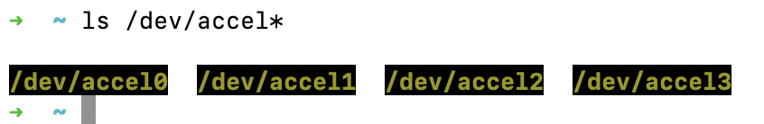
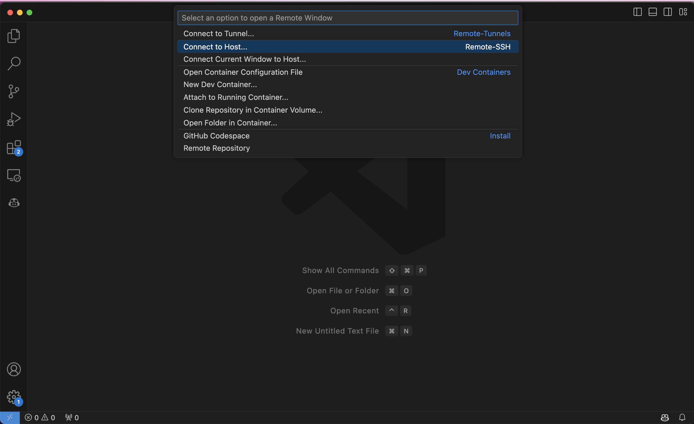

# TPU Quickstart Guide: 

## Part 1 - Setting Up

This guide will help you get started with using Tensor Processing Units (TPUs) on Google Cloud Platform.

## Introduction

Tensor Processing Units (TPUs) are custom-designed hardware accelerators for running machine learning workloads. This guide will walk you through the process of setting up and using TPUs in the Google Cloud Console.

## Prerequisites

- A Google Cloud account
- Billing enabled for your project
- TPU API enabled in your project

## Step 1: Accessing the TPU Dashboard

1. Go to [https://console.cloud.google.com/](https://console.cloud.google.com/)
2. Navigate to the TPU section

You should see a screen similar to the one below:


## TPU Configuration

In this example, we're using the following configuration:

- Zone: us-central1-b
- TPU type: v3-8
- TPU software version: tpu-ubuntu2204-base
- Architecture: TPU VM

## Part 2: Setting Up SSH Access for Google Cloud TPUs

### Step 2: Add an SSH public key to Google Cloud

When setting up SSH access for Google Cloud TPUs, it's important to note that using `ssh-copy-id` is not the correct approach. Instead, follow these steps:

1. Navigate to the Google Cloud Console
2. Type "SSH keys" into the search box
3. Go to the relevant page
4. Click "Edit"
5. Add your computer's SSH public key

To view your computer's SSH public key, use the following command:

```bash
cat ~/.ssh/id_rsa.pub
```

# Step 3: SSH to TPU VM

After adding your SSH public key to Google Cloud, you can set up easy access to your TPU VM. Instead of using nano, we'll use vim for editing the SSH config file.

## Create or edit your computer's ~/.ssh/config:

```bash
vim ~/.ssh/config
```

Add the following content:
```bash
Host tpuv3-8-1
    User tommyly
    Hostname 34.16.41.193
```

Hostname is the IP address of the TPU VM.

If you connect successfully, it will show this in your Terminal



Type in this in your Command Line
```bash
ls /dev/accel*
```

You should see something like this:



## Create a virtual environment (venv):

```bash
python3.12 -m venv ~/venv
```

Activate the venv:
```bash
. ~/venv/bin/activate
```
Install JAX in the venv:
```bash
pip install -U pip
pip install -U wheel
pip install -U "jax[tpu]" -f https://storage.googleapis.com/jax-releases/libtpu_releases.html
```
# Step 8: Configure VSCode Remote-SSH

1. **Open VSCode**: Launch Visual Studio Code on your computer.

2. **Access the Extensions Panel**: On the left side of the window, click on the Extensions icon to open the Extensions panel.

3. **Install Remote - SSH**:
    - In the Extensions panel, search for "Remote - SSH".
    - Click "Install" to add the extension to VSCode.

4. **Connect to Host**:
    - Press `F1` to open the command palette.
    - Type `ssh` and select "Remote-SSH: Connect to Host...".
    - Click on the server name you set in `~/.ssh/config` (e.g., `tpuv3-8-1`).

5. **Setup Completion**: Once VSCode completes the setup on the server, you can develop directly on the server with VSCode.


