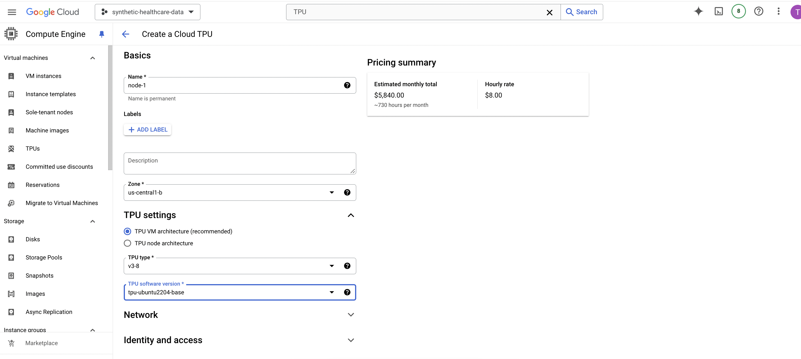

# TPU Quickstart Guide: 

## Part 1 - Setting Up

This guide will help you get started with using Tensor Processing Units (TPUs) on Google Cloud Platform.

## Introduction

Tensor Processing Units (TPUs) are custom-designed hardware accelerators for running machine learning workloads. This guide will walk you through the process of setting up and using TPUs in the Google Cloud Console.

## Prerequisites

- A Google Cloud account
- Billing enabled for your project
- TPU API enabled in your project

## Step 1: Accessing the TPU Dashboard

1. Go to [https://console.cloud.google.com/](https://console.cloud.google.com/)
2. Navigate to the TPU section

You should see a screen similar to the one below:



## TPU Configuration

In this example, we're using the following configuration:

- Zone: us-central1-b
- TPU type: v3-8
- TPU software version: tpu-ubuntu2204-base
- Architecture: TPU VM

## Part 2: Setting Up SSH Access for Google Cloud TPUs

### Step 2: Add an SSH public key to Google Cloud

When setting up SSH access for Google Cloud TPUs, it's important to note that using `ssh-copy-id` is not the correct approach. Instead, follow these steps:

1. Navigate to the Google Cloud Console
2. Type "SSH keys" into the search box
3. Go to the relevant page
4. Click "Edit"
5. Add your computer's SSH public key

To view your computer's SSH public key, use the following command:

```bash
cat ~/.ssh/id_rsa.pub
